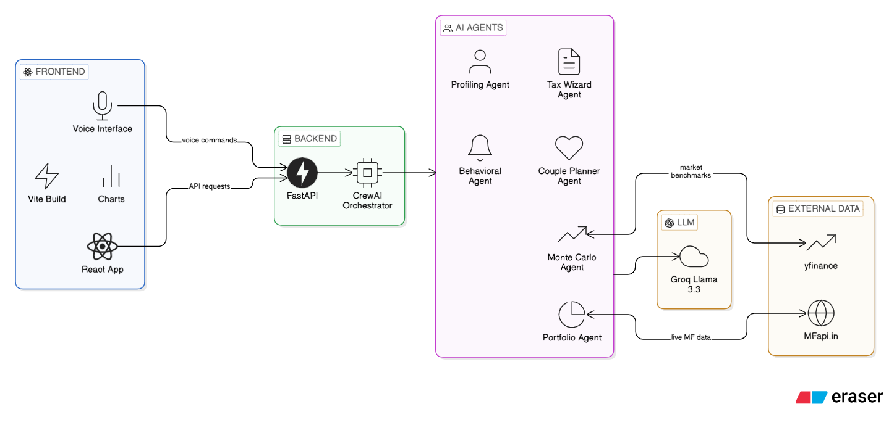
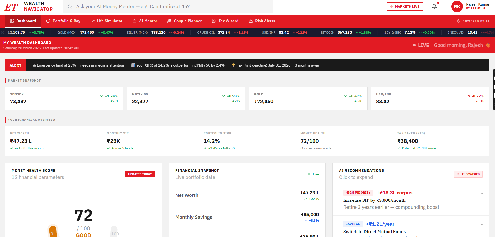

# ET Wealth Navigator

**AI-Powered Personal Finance Mentor**  
**Problem Statement #9** • ET AI Hackathon 2026


---

## 📍 The Problem
**95% of Indians don’t have a proper financial plan.**  
Financial advisors are expensive (₹25,000+/year) and serve only HNIs. Most retail investors manage their money on tips, gut feeling, and social media noise.

## 🧠 Our Solution
**ET Wealth Navigator** is an intelligent, voice-first AI Money Mentor that lives inside the ET ecosystem. It turns confused savers into confident investors by combining real Indian market data, multi-agent AI reasoning, and beautiful simulations.

It’s not just another chatbot — it’s a complete **AI Co-Pilot for Indian Personal Finance**.

---

## ✨ Key Features

| Feature                        | Description |
|-------------------------------|-----------|
| **Money Health Score**        | 6-dimension financial wellness score (Emergency Fund, Insurance, Diversification, Tax Efficiency, etc.) |
| **Portfolio X-Ray**           | Upload CAMS/KFintech statement → instant overlap analysis, expense drag, XIRR, sector exposure |
| **Monte Carlo Life Simulator**| 1,000 probabilistic simulations with real Indian market volatility + interactive “What-If” sliders |
| **Voice-First AI Mentor**     | WhatsApp-style voice chat — speak naturally and get spoken financial advice |
| **Tax Wizard**                | Form-16 upload + old vs new regime comparison with exact ₹ savings |
| **Couple’s Joint Planner**    | India-first tool that optimizes combined finances, tax, SIP split & insurance |
| **Risk Alerts & Nudges**      | Behavioral finance alerts with actionable recommendations |

---

## 🛠 Tech Stack

**Frontend**  
- React + Vite  
- Tailwind CSS + shadcn/ui  
- Recharts + Framer Motion  
- Voice Recognition & Speech Synthesis

**Backend** 
- FastAPI + Python  
- CrewAI (Multi-Agent System)  
- Groq (Llama-3.3-70B)

**Data Sources**  
- MFapi.in (Live Mutual Fund data)  
- yfinance (Market benchmarks)

---

## 🎯 Why This Wins

- Directly solves a massive real Indian problem (PS #9)
- Strong social impact + high judge appeal
- Beautiful, production-grade UI with ET branding
- Advanced AI features (Monte Carlo, multi-agent, voice)
- Clear measurable impact (tax saved, years earlier retirement, XIRR improvement)

---

## System Architecture:



Interactive Dashboard & Insights

---

## 👥 Team

- **Krupa**   
- **Kavya** 

---

**Built with ❤️ for ET AI Hackathon 2026**

---


```bash
# Clone the repository
git clone https://github.com/krupam26/ET_Gen_AI.git

# Go to frontend folder
cd ET_Gen_AI/frontend

# Install dependencies
npm install

# Start development server
npm run dev

#go to backend folder
cd backend

# Create virtual environment
python -m venv venv

# Activate virtual environment
# Windows:
venv\Scripts\activate
# Mac/Linux:
source venv/bin/activate

# Install dependencies
pip install fastapi uvicorn crewai groq python-dotenv requests numpy pandas

# Create .env file with your Groq API key
echo "GROQ_API_KEY=your_groq_api_key_here" > .env

# Run backend
uvicorn main:app --reload --port 8000
